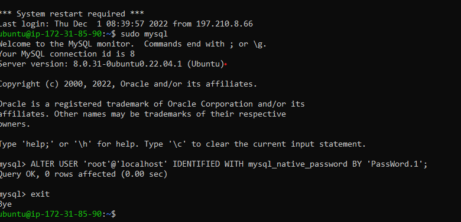
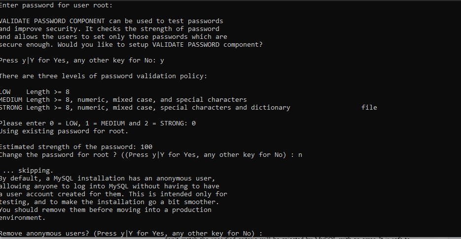
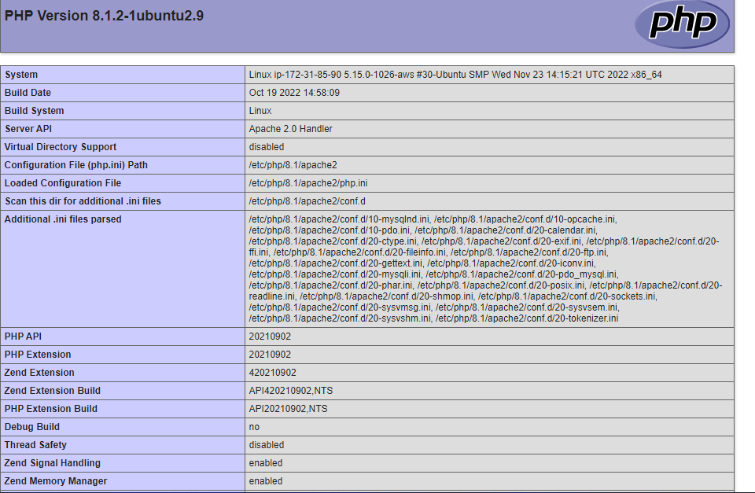

# PBLproject1
Task1
## Lamp-Stack-Implemetation
As a Devops Engineer documentation has to be one of my greatest strength.
This is a fun project  to improve my documentation skill.
# What is a Lamp Stack?

A LAMP stack is a set of open-source tools used for web application development.
For a web application to work, it has to include a server operating system, a web server, a database, and a programming language.
Each layer of software is necessary for creating a database-driven and dynamic website.
LAMP is a collection of four components that make up a fully functional web development environment. The LAMP acronym contains the initials of the components' names:

1. [Linux](https://phoenixnap.com/glossary/what-is-linux) Operating System
2. [Apache](https://phoenixnap.com/kb/nginx-vs-apache) HTTP SERVER
3. [MySQL](https://phoenixnap.com/kb/install-mysql-ubuntu-20-04) database management system
4. [PHP](https://phoenixnap.com/kb/check-php-version) programming language 

# How to Install LAMP Stack AWS

# Create an Ec2 instance 
*Select region (and launch a new EC2 instance of t2.micro family with Ubuntu Server 20.04 LTS (HVM)*

*Create a Key pair while creating the EC2 instance (in this case i created a .pem key to ssh into my instance)*

*to connect to the Ec2 instance, run the following command*

`ssh -i "task_one.pem" ubuntu@ec.<Public-IP>.compute-1.amazonaws.com`

## install Apache2 and update firewall

1. To update the list of packages in package manager, use the following command 

`sudo apt update`

2. Run the following command for apache2 package installation 

`sudo apt install apache2`

3. To verify that apache2 is running as a Service in the OS, run following command

`sudo systemctl apache2`

4.  Verify that there is  access locally to the server in the Ubuntu shell, using the either of the following commands.

`curl http://localhost:80` 

`curl http://127.0.0.1:80`

## Test how the Apache HTTP server can respond to requests from the Internet.

[my apache server](http://3.83.230.3:80)(this will not work because the server is no longer running)

## MySQL installation 
1. On the command line run following command to install MySQL

`sudo apt install mysql-server`

2. Sudo into the server with the next command

 `sudo mysql`

 

3. Change the password for the root user

 `ALTER USER 'root'@'localhost' IDENTIFIED WITH mysql_native_password BY 'PassWord.1`

To secure server run the next commands

`sudo mysql_secure_installation`

`sudo mysql -p`

`mysql> exit`

## Installing PHP 
 Apache is installed to serve content and MySQL installed to store and manage data. PHP is the component of this setup that will process code to display dynamic content to the end user. In addition to the php package,  php-mysql,will be needed a PHP module that allows PHP to communicate with MySQL-based databases.  libapache2-mod-php is needed to enable Apache to handle PHP files. Core PHP packages will automatically be installed as dependencies.

1.  To install these 3 packages, run:

`sudo apt install php libapache2-mod-php php-mysql`

2. After installation run the following command to check the installed version 

`php -v`

## Creating a virtual host for my website using APACHE2(projectlamp is my domain name)

1.  Create a directory projectlamp

`sudo mkdir /var/www/projectlamp`

2. Assigne ownership of the directory with current system user using the command

`sudo chown -R $USER:$USER /var/www/projectlamp`

3. Create and open a new configuration file in Apache’s usinng the command line

`sudo vi /etc/apache2/sites-available/projectlamp.conf`

4. Copy and paste the command below in the vim file and save

    `<VirtualHost *:80>
       ServerName projectlamp
        ServerAlias www.projectlamp 
         ServerAdmin
         webmaster@localhost
         Document Root /var/www/projectlamp
       ErrorLog ${APACHE_LOG_DIR}/error.log
      CustomLog ${APACHE_LOG_DIR}/access.log combined
   </VirtualHost>`

5. To list available sites run the following commands

'sudo ls /etc/apache2/sites-available'

6. There will be a prompt  to reload APACHE

`sudo systemctl reload apache2`

7. Run the next command to test  configuration

`sudo apache2ctl configtest`

8. Disable Apache default website using the command

`sudo a2dissite 000-default`

9. Create an index.html file in that location to test that the virtual host works as expected using the command

`sudo echo 'Hello LAMP from hostname' $(curl -s http://169.254.169.254/latest/meta-data/public-hostname) 'with public IP' $(curl -s http://169.254.169.254/latest/meta-data/public-ipv4) > /var/www/projectlamp/index.html`

- New website is now active, the text from ‘echo’ command you wrote to index.html file, will be visible. This  means  that  Apache virtual host is working as expected.
The server’s public hostname (DNS name) and public IP address will be in the output. Website can be  accessed in the  browser by public DNS name, not only by IP – try it out, the result must be the same (port is optional)

'http://<Public-IP-Adress>:80'

## Enable PHP on website

1.  Edit  the conf file with the command

`sudo vim /etc/apache2/mods-enabled/dir.conf`

2. Paste in the command

   ` <IfModule mod_dir.c>
     #Change this:
     #DirectoryIndex index.html index.cgi 
    index.pl index.php index.xhtml index.htm
    #To this:
    DirectoryIndex index.php index.html 
   index.cgi index.pl index.xhtml index.htm
    </IfModule>`

3. Reloaded Apache

`sudo systemctl reload apache2`

4. Create index.php file

`vim /var/www/projectlamp/index.php`

5. Add the following text, which is valid PHP code, inside the file:

                                       
    `<?php
   phpinfo();`

6. Save and closed the file.  Refresh. This should be your  landing page:

This page provides information about the server from the perspective of PHP. It is useful for debugging and to ensure that settings are applied correctly.
If you can see this page in your browser, then the PHP installation is working as expected.
After checking the relevant information about the PHP server through that page, it’s best to remove the file created because it contains sensitive information about the PHP environment -and the Ubuntu server.  Use rm to do so:

`sudo rm /var/www/projectlamp/index.php`

