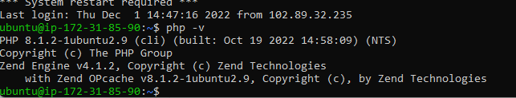

# PBLproject1
Task1
## Lamp-Stack-Implemetation
As a Devops Engineer documentation has to be one of my greatest strength.
This is a fun project  to improve my documentation skill.
# What is a Lamp Stack?

A LAMP stack is a set of open-source tools used for web application development.
For a web application to work, it has to include a server operating system, a web server, a database, and a programming language.
Each layer of software is necessary for creating a database-driven and dynamic website.
LAMP is a collection of four components that make up a fully functional web development environment. The LAMP acronym contains the initials of the components' names:

1. [Linux](https://phoenixnap.com/glossary/what-is-linux) Operating System
2. [Apache](https://phoenixnap.com/kb/nginx-vs-apache) HTTP SERVER
3. [MySQL](https://phoenixnap.com/kb/install-mysql-ubuntu-20-04) database management system
4. [PHP](https://phoenixnap.com/kb/check-php-version) programming language 

# How to Install LAMP Stack AWS

# Create an Ec2 instance 
*Select region (and launch a new EC2 instance of t2.micro family with Ubuntu Server 20.04 LTS (HVM)*

*Create a Key pair while creating the EC2 instance (in this case i created a .pem key to ssh into my instance)*

*to connect to the Ec2 instance, i ran the following command*

'ssh -i "task_one.pem" ubuntu@ec2-3-83-230-3.compute-1.amazonaws.com'

## install Apache2 and update firewall

1. To update a list of packages in package manager,  i used the following command 

`sudo apt update`

2. I ran the following command for apache2 package installation 

'sudo apt install apache2'

3. To verify that apache2 is running as a Service in our OS, i ran following command

'sudo systemctl apache2'

4. I verified if i had access locally to the server in the Ubuntu shell, using the either of the following commands.

'curl http://localhost:80' 

'curl http://127.0.0.1:80'

## I did a test on  how my Apache HTTP server can respond to requests from the Internet.

[my apache server](http://3.83.230.3:80)

## MySQL installation 
1. On the command line i ran the following command to install MySQL

'sudo apt install mysql-server'

2. Sudo into the server with the next command

 'sudo mysql'

 

 'ALTER USER 'root'@'localhost' IDENTIFIED WITH mysql_native_password BY 'PassWord.1'

To secure my server i ran the next commands

'sudo mysql_secure_installation'

'sudo mysql -p'

'mysql> exit'

## Installing PHP 
1. I ran the following command to install 3 packages

'sudo apt install php libapache2-mod-php php-mysql'

2. After installation i ran the following command to check the installed version 

'php -v'

## Creating a virtual host for my website using APACHE2(projectlamp is my domain name)

1. I created a directory projectlamp

'sudo mkdir /var/www/projectlamp'

2. I  assigned ownership of the directory with current system user using the command

'sudo chown -R $USER:$USER /var/www/projectlamp'

3. I Created and open a new configuration file in Apache’s usinng the command line

'sudo vi /etc/apache2/sites-available/projectlamp.conf'

4. I copied and pasted the command below in the vim file and saved

                 '<VirtualHost *:80>
                     ServerName projectlamp
                    ServerAlias www.projectlamp 
                    ServerAdmin webmaster@localhost
                    DocumentRoot /var/www/projectlamp
                    ErrorLog ${APACHE_LOG_DIR}/error.log
                     CustomLog ${APACHE_LOG_DIR}/access.log combined
                  </VirtualHost>'

5. To list available sites run the following commands

'sudo ls /etc/apache2/sites-available'

6. I was prompted to resload APACHE

'sudo systemctl reload apache2' 

7. Ran the next command to test my configuration

'sudo apache2ctl configtest'

8. I  disabled  Apache default website using the command

'sudo a2dissite 000-default'

'sudo echo 'Hello LAMP from hostname' $(curl -s http://169.254.169.254/latest/meta-data/public-hostname) 'with public IP' $(curl -s http://169.254.169.254/latest/meta-data/public-ipv4) > /var/www/projectlamp/index.html'

'http://3.83.230.3/:80'

## Enable PHP on website

'sudo vim /etc/apache2/mods-enabled/dir.conf'

'sudo systemctl reload apache2'

'vim /var/www/projectlamp/index.php'

