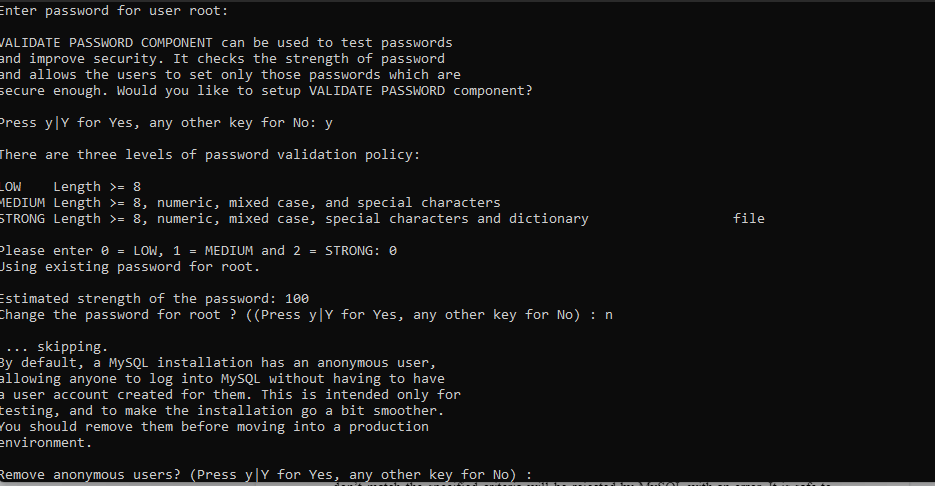

## DOCUMENTATTION TO DOWNLOAD A LAMP STACK
## I ran the following commands to install Apache2

`sudo apt update`

'sudo apt install apache2'

'sudo systemctl apache2'

##  We can access  our Apache server locally in our Ubuntu shell by running curl command. I ran the first command. The second command does the same thing.

'curl http://localhost:80' 

'curl http://127.0.0.1:80'

## I did a test on  how my Apache HTTP server can respond to requests from the Internet.

[my apache server](http://3.83.230.3:80)

## Mysql installation (Database management system, mysql is a relational database)

'sudo apt install mysql-server'

 'sudo mysql'

 

 'ALTER USER 'root'@'localhost' IDENTIFIED WITH mysql_native_password BY 'PassWord.1'

'mysql> exit'

'sudo mysql_secure_installation'

'sudo mysql -p'

'sudo mysql -p'

'mysql> exit'

## Installing PHP (The programming language for our server)

'sudo apt install php libapache2-mod-php php-mysql'

'php -v'

## Creating a virtual host for my website using Apache2(projectlamp is my domain name)

'sudo mkdir /var/www/projectlamp'

'sudo chown -R $USER:$USER /var/www/projectlamp'

'sudo vi /etc/apache2/sites-available/projectlamp.conf'

'sudo ls /etc/apache2/sites-available'

'sudo systemctl reload apache2' 

'sudo apache2ctl configtest

'sudo a2dissite 000-default'

'sudo echo 'Hello LAMP from hostname' $(curl -s http://169.254.169.254/latest/meta-data/public-hostname) 'with public IP' $(curl -s http://169.254.169.254/latest/meta-data/public-ipv4) > /var/www/projectlamp/index.html'

'http://3.83.230.3/:80'

## Enable PHP on website

'sudo vim /etc/apache2/mods-enabled/dir.conf'

'sudo systemctl reload apache2'

'vim /var/www/projectlamp/index.php'

